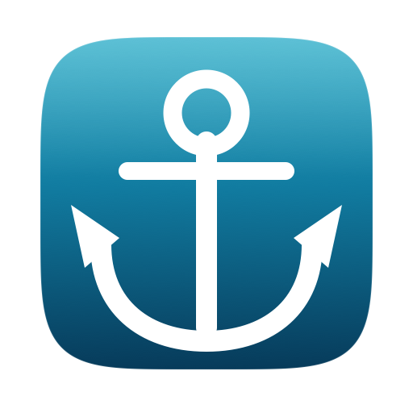

<p align="center">
  
</p>

<h1 align="center">Harbormaster</h1>

<p align="center">
  A macOS menu bar app for watching and killing the TCP ports your dev servers are sitting on.
</p>

A harbormaster assigns berths and can order a vessel out. Same idea: see what's docked on your
dev ports, and evict it.

Native Swift + SwiftUI (`MenuBarExtra`, macOS 13+). No Electron, no Tauri, no dock icon, no
main window. It replaces a `ports.sh` script + web UI, and stays compatible with the script by
sharing the same label file.


The menu bar shows a filled plug plus a count while ports are listening, and an outline plug
when everything is idle.

## Features

- **Menu bar only** (`LSUIElement`) — an outline plug when nothing is listening, a filled plug
  plus a count badge when ports are active. Both are template images, so macOS tints them
  black or white to match the menu bar, the same as any built-in status item.
- **Watch individual ports**, not a range — `3000`, `5432`, `8080` and `6379` can all be
  watched together without dragging in everything in between.
- **Only active ports are listed.** Idle watched ports are still scanned and still keep their
  labels; they just don't clutter the dropdown.
- **Auto-detected labels** — an unlabeled port shows its project name greyed out, taken from
  the server process's working directory. Type over it to set a real label.
- **Inline labels** — click the text field, type, press Enter or click away to save.
- **Open in browser** — the ↗ button opens `http://localhost:<port>` in your default browser.
- **Kill** — one click, no confirmation. The button turns red under the cursor.
- **Auto-refresh** on a timer (default 3s), plus manual refresh (`⌘R`).
- **Preferences** (`⌘,`) — add/remove watched ports, refresh interval, launch at login.

## Install

### Download a build

It's a universal binary — Apple Silicon and Intel. `/Applications` is recommended, and
**required** for launch-at-login to work reliably.

**From the terminal** — the quarantine attribute that triggers the Gatekeeper warning is set
by *browsers*, not by `gh` or `curl`, so this route has no extra steps:

```bash
gh release download --repo oppatrickk/harbormaster --pattern '*.zip'
# ditto, not unzip: it preserves the bundle's symlinks and signature.
ditto -x -k Harbormaster-*.zip /Applications/
open /Applications/Harbormaster.app
```

**From the browser** — grab the latest `Harbormaster-<version>.zip` from the
[**Releases**](https://github.com/oppatrickk/harbormaster/releases) page, unzip it, and drag
`Harbormaster.app` to `/Applications`. macOS will then refuse to open it, reporting that the
app *"is damaged"*. Either:

- **System Settings** → Privacy & Security → scroll to Security, where an **Open Anyway**
  button appears once you've tried to open the app and been blocked.
- **Or in Terminal:**

  ```bash
  xattr -dr com.apple.quarantine /Applications/Harbormaster.app
  ```

> **Why:** these builds are ad-hoc signed but **not notarized** — notarizing requires a paid
> Apple Developer account. *"Damaged"* is Gatekeeper's generic wording for "failed the check",
> not a claim about the file, which is byte-identical to what CI built. Building from source
> avoids it entirely: locally built apps are never quarantined.

### Requirements

- macOS 13 (Ventura) or later
- Xcode 16 or later to build (Swift Testing is used for the unit tests)

## Build and run

```bash
git clone https://github.com/oppatrickk/harbormaster.git
cd harbormaster

# Build
xcodebuild build -project Harbormaster.xcodeproj -scheme Harbormaster -configuration Release

# Run it from the build directory
open "$(xcodebuild -project Harbormaster.xcodeproj -scheme Harbormaster -configuration Release \
        -showBuildSettings 2>/dev/null \
        | awk -F' = ' '/ BUILT_PRODUCTS_DIR/ {print $2}')/Harbormaster.app"
```

Or just open `Harbormaster.xcodeproj` in Xcode and hit Run.

Nothing appears in the Dock — look for the plug icon in the menu bar.

### Install to /Applications

Recommended, and **required** for launch-at-login to work reliably:

```bash
xcodebuild build -project Harbormaster.xcodeproj -scheme Harbormaster -configuration Release \
  -derivedDataPath ./build
cp -R ./build/Build/Products/Release/Harbormaster.app /Applications/
open /Applications/Harbormaster.app
```

### Cut a release

```bash
./Scripts/build-release.sh
```

Builds Release, verifies the app icon actually made it into the bundle, and packages
`dist/Harbormaster-<version>.zip` with `ditto` (not `zip`, which mangles bundle symlinks and
breaks the signature). It prints the SHA-256 and the `gh release create` line to run next.

Pushing a `v*` tag does the whole thing on CI instead — [`.github/workflows/release.yml`](.github/workflows/release.yml)
runs the tests, builds the zip, and attaches it to a GitHub release:

```bash
# Bump MARKETING_VERSION in the project first, then:
git tag v1.1 && git push origin v1.1
```

The version comes from `MARKETING_VERSION` in the Xcode project — the script reads it rather
than keeping its own copy, so there's one place to bump.

### Run the tests

```bash
xcodebuild test -project Harbormaster.xcodeproj -scheme Harbormaster
```

96 tests across 5 suites covering the `lsof` parsers, the row model, the settings store, and
the label file format. None of them touch your real `~/.ports_labels.tsv` or app settings —
the label tests use a temp directory and the settings tests use an isolated UserDefaults suite.

## Choosing which ports to watch

Preferences → **Watched Ports**. Type a port, press Enter or click Add. Click the ⊖ next to a
port to stop watching it.

Ports are watched individually and don't have to be consecutive. A fresh install watches
3000–3010 (as eleven individual entries), which you can prune or extend.

The dropdown lists only the ports that are actually in use. Watching a port you rarely run is
therefore cheap — it stays out of the list until something binds it.

If you're upgrading from a version that stored a contiguous range, that range is migrated into
the individual ports it covered, so nothing changes out from under you.

## Launch at login

Open **Preferences → Launch at login** and flip the toggle. It's **off by default**.

This uses `SMAppService` (the modern API, not the deprecated `SMLoginItemSetEnabled` /
`LSSharedFileList` login-item APIs). The toggle reads its state back from
`SMAppService.mainApp.status` rather than caching it, so what you see is what the system
actually has registered.

**Caveat worth knowing about:** `SMAppService` requires a code-signed bundle. This project is
configured for ad-hoc signing (`CODE_SIGN_IDENTITY = "-"`) so it builds on any machine with no
Apple Developer account. Ad-hoc signed apps *can* register as login items, but macOS is
inconsistent about it. If the toggle throws an error:

1. Make sure the app is in `/Applications` and you launched it from there — not from
   `DerivedData`.
2. Check **System Settings → General → Login Items**; macOS may be waiting on your approval.
3. If you do have a Developer ID certificate, set `DEVELOPMENT_TEAM` and
   `CODE_SIGN_IDENTITY` on the `Harbormaster` target and it becomes reliable.

Any failure is shown inline in Preferences rather than silently flipping the toggle back.

## Labels

An unlabeled port shows a greyed-out guess: the basename of the server process's working
directory, found with `lsof -a -p <pid> -d cwd`. A `vite dev` server started in
`~/Work/streamline_mes_due_soon` shows as `streamline_mes_due_soon`.

This is a placeholder only. It is **never** written to `~/.ports_labels.tsv` — the file shared
with `ports.sh` stays limited to labels you actually typed. Processes running from `/` or from
your bare home directory get no guess, since neither says anything useful.

Lookups are cached per PID and pruned to live processes, so the extra `lsof` call doesn't run
on every refresh tick.

## Label file (`~/.ports_labels.tsv`)

Labels live in `~/.ports_labels.tsv`, tab-separated, one line per labeled port:

```
3000	api
3001	storefront
5432	db
```

This is the same file `ports.sh` uses, and both tools can be used interchangeably:

- Lines are sorted by port ascending, so the file stays diff-stable.
- A port's line is **removed** when its label is cleared or the port is killed.
- Every write re-reads the file first, so a label added by the script between refresh ticks is
  not clobbered.
- Malformed and blank lines are skipped rather than failing the load — it's a hand-editable
  file.
- Reads handle both LF and CRLF line endings.

Edit the file by hand and the app picks it up on the next refresh.

> **Note:** killing a port deletes its label line, per the original `ports.sh` contract. You may
> prefer labels to survive a kill so a restarted server keeps its name. That's a one-line
> change — drop the `removeLabel` call in `PortsViewModel.kill`.

## How ports are discovered

One `lsof` call per refresh, with one `-i` flag per watched port:

```
/usr/sbin/lsof -nP -iTCP:3000 -iTCP:3001 -iTCP:5432 -sTCP:LISTEN -F pcn +c 0
```

A few details the implementation depends on, all verified against lsof 4.91 and covered by
tests:

- **Multiple `-i` flags are OR'd**, so one call covers the whole watch list however
  non-contiguous it is.
- **`lsof` exits 1 if *any* search term matched nothing — even when other terms returned
  data.** With one flag per port, a single idle port in your list produces exit 1 alongside
  perfectly good output. Treating exit 1 as failure would break the normal case entirely.
- **With no `-i` flag at all, `lsof` lists every open file on the system** (~30k lines). An
  empty watch list therefore short-circuits and never reaches the process spawn.
- **`-F pcn` (field output), not the column output.** The default `COMMAND` column truncates to
  9 characters, turning `language_server_macos_arm` into `language_`. `+c 0` lifts the limit.
- **Field output is stateful.** A `p<pid>` line opens a process block and `c<command>` names it;
  *several* `f<fd>`/`n<address>` pairs can follow, all belonging to that process.
- **Duplicate rows get collapsed.** A process listening on both IPv4 and IPv6 reports the same
  port on multiple descriptors; results are deduped on `(port, pid)`.
- **Three address shapes** are parsed: `[::1]:3001`, `*:63942`, `127.0.0.1:5037`.

Killing sends `SIGKILL` via `kill(2)`. `ESRCH` (already gone) counts as success; `EPERM` is
reported as "belongs to another user". PIDs are validated as `> 0` first, since `kill(0, …)`
signals an entire process group and `kill(-1, …)` signals everything you own.

## Project layout

```
Harbormaster/
  HarbormasterApp.swift   @main — MenuBarExtra + Preferences window scenes
  PortsViewModel.swift    refresh loop, orchestration (@MainActor)
  Core/                   no UI imports — this is the tested layer
    ListeningPort.swift   a socket found in LISTEN state
    PortRow.swift         a watched port + its listener (if any) + label
    PortScanner.swift     lsof invocation + parsing
    ProcessDirectory.swift  cwd -> project name, for auto-detected labels
    LabelStore.swift      ~/.ports_labels.tsv read/write
    ProcessKiller.swift
    LoginItem.swift       SMAppService wrapper
    Preferences.swift     watched ports, interval, migration
  Views/
    MenuBarLabel.swift    status item icon + count badge
    PortListView.swift
    PortRowView.swift
    PreferencesView.swift
  Assets.xcassets/
    AppIcon.appiconset/   generated — see "App icon" below
HarbormasterTests/
  PortScannerParsingTests.swift
  PortRowTests.swift
  PreferencesTests.swift
  ProcessDirectoryTests.swift
  LabelStoreTests.swift
Scripts/
  generate-icon.swift     draws the app icon at every required size
  build-release.sh        Release build -> dist/Harbormaster-<version>.zip
```

`Core/` has no SwiftUI/AppKit dependency. `PortScanner` takes a `CommandRunner`, `LabelStore`
takes a file URL, and `Preferences` takes a `UserDefaults`, so all three are testable without
spawning `lsof` or touching your home directory.

## App icon

A white anchor on a dusk-harbor gradient. It's **drawn in code**, not stored as source art:

```bash
swift Scripts/generate-icon.swift
```

That rewrites all ten PNGs in `Harbormaster/Assets.xcassets/AppIcon.appiconset/` (16pt through
512pt, @1x and @2x) plus their `Contents.json`. Xcode compiles them into `Assets.car` and an
`AppIcon.icns` at build time.

Generating it means the icon is reviewable as a diff — adjust a coordinate or a gradient stop
in the script, re-run, and every size is regenerated consistently. Two details worth knowing if
you edit it:

- The plate is a **superellipse**, sampled parametrically rather than drawn as a rounded rect.
  macOS icon corners curve continuously into the straight edges; a circular-cornered rect meets
  them at a tangent and reads as subtly wrong next to real macOS icons.
- The art sits in an 824pt box inside the 1024pt canvas. That ~82% inset is the standard macOS
  icon grid, and it's what keeps the icon optically the same size as its neighbours in Finder.

The menu bar status item is unrelated to this — it's an SF Symbol template image, drawn in
`MenuBarLabel.swift`, so macOS can tint it to match the menu bar.

## Notes and non-goals

- Not sandboxed, and **can't be** — the Mac App Store requires the App Sandbox, which blocks
  spawning `lsof`, signalling processes the app doesn't own, and writing `~/.ports_labels.tsv`.
  Those three things are the entire app, so this is a Developer ID / build-it-yourself tool by
  necessity rather than by preference.
- No privilege elevation. You can only kill processes you own; anything else reports `EPERM`.
- `lsof` shows ports owned by other users, but killing them will fail by design.

## License

[MIT](LICENSE) — © 2026 John Patrick Prieto.
